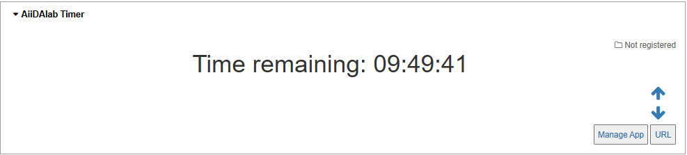
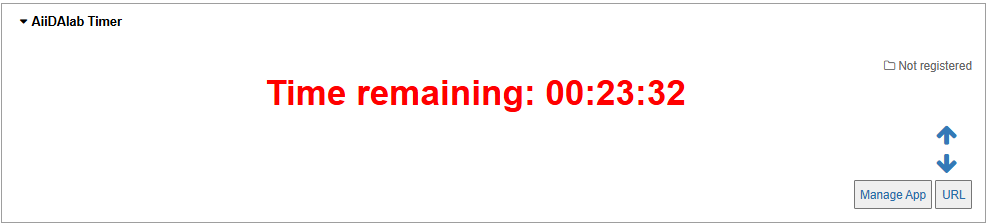
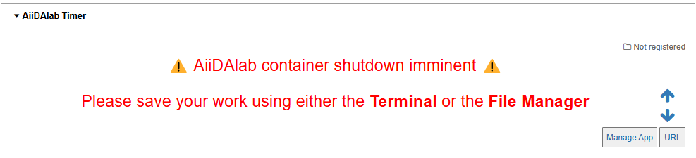
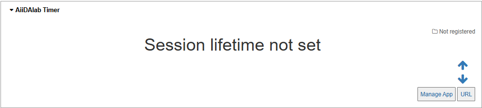

# AiiDAlab Timer

An app to display a timer in its aiidalab-home container. The timer represents a countdown from an AiiDAlab-container-configured lifetime (`.aiidalab/aiidalab.yaml:lifetime`).

## Installation

This Jupyter-based app is intended to be run with [AiiDAlab](https://www.materialscloud.org/aiidalab).

Assuming that the app was registered, you can install it directly via the app store in AiiDAlab or on the command line with:

```
aiidalab install aiidalab-timer
```

Otherwise, you can also install it directly from the repository:

```
aiidalab install aiidalab-timer@https://github.com/edan-bainglass/aiidalab-timer
```

## Usage

If configured, the timer app container will display the following:

- Time > 30 minutes



- Time < 30 minutes



- Time < 5 minutes



- Time not configured



## License

MIT

## Contact

edan.bainglass@psi.ch
